# OpenCV with Python

1. 環境づくり
- 画像生成
- 画像読み込み
- 画像の色の平均値出す
- 画素をいじる
- トリミング
- リサイズ
- 加算
- アフィン変換
- 反転
- グレースケール変換
- 描画関数のCircleを使う。
- 色の抽出
- カラーチェンネル入れ替え
- alphaチャンネルの操作 ※途中

## 環境づくり
はいさて。画像処理まともに勉強せんとな。。！そんならopenCVだろ！と思ったところで、   
openCVをいじる環境を整えるのが一苦労なのです。普通の人は。    
とりあえずpythonでいじろうと思います。    
構成は

 - pyenv-virtualenv
 - anaconda
 - opencv

（Mac OSX Yosemite 10.10.5,Python 2.7.11,opencv 2.4.12）   

です。今時じゃないのが悔しいが。。     
python2.7でopencv2で書かれてる情報が多いからとりあえずの勉強はこれでよいかも。   

僕の場合pyenv-virtualenvがhomebrewで昔入れてました。別にバージョン管理とかいらねえよって方はごめんなさい。   
[MacのHomebrewでpyenv-virtualenv環境を作る](http://qiita.com/jjongs08/items/521eddea150795749711)    
たぶんこのへん参考にしたらできます。

pyenvの環境ができたら
勉強したいディレクトリに移動
```shell
cd ~/study/st_opencv/

pyenv install anaconda-2.1.0
pyenv local anaconda-2.1.0
pyenv rehash

~~インストール後に
conda install -c https://conda.binstar.org/jjhelmus opencv
```
どりゃ。これでopencvいじれます。簡単すぎ   
ありがとうここ     
[pythonでOpenCVを使う一番簡単な方法](http://qiita.com/ru_pe129/items/8a1a75cdf713d4fa6bc8)


## 画像生成
```python
import numpy as np
import cv2

r = 0
g = 0
b = 255

width = 480
height = 360
pixel = np.array([b,g,r],np.uint8)
wGrid = np.array([pixel]*width,np.uint8)
newImg = np.array([wGrid]*height,np.uint8)

cv2.imshow('generate img',newImg)
cv2.imwrite('createimg.png',newImg)
cv2.waitKey(0)

```


## 画像読み込み

```python
# -*- coding: utf-8 -*-
import cv2, matplotlib
import numpy as np
import matplotlib.pyplot as plt

img = cv2.imread('sample.png')

cv2.imshow('result',img)
cv2.waitKey(0)
```


## 画像の色の平均値出す
```python
# -*- coding: utf-8 -*-
import cv2, matplotlib
import numpy as np
import matplotlib.pyplot as plt

img = cv2.imread('sample.png')

average_color_per_row = np.average(img, axis=0)
average_color = np.average(average_color_per_row, axis=0)
average_color = np.uint8(average_color)
average_color_img = np.array([[average_color]*500]*500, np.uint8)


cv2.imshow('average',average_color_img)
cv2.imwrite('avarage.png',average_color_img)
cv2.waitKey(0)
```


## 画素をいじる
```python
# -*- coding: utf-8 -*-
import cv2, matplotlib
import numpy as np
import matplotlib.pyplot as plt

###
# 画素へのアクセス
###

cols = 640
rows = 480

#イメージ生成
image = cv2.imread('sample.png')

# print image
print image[0,1]

width = image.shape[0]
height = image.shape[1]
amount = 2.0

# pixelごといじる。
for x in xrange(0,width):
  for y in xrange(0,height):
    pixel = image[x,y]
    b = pixel[0]
    g = pixel[1]
    r = pixel[2]

    if x < width/2 and y < height/2:
      color = np.array([b,g,r*amount],np.uint8)
    elif x > width/2 and y < height/2:
      color = np.array([b,g*amount,r],np.uint8)
    elif x < width/2 and y > height/2:
      color = np.array([b*amount,g,r],np.uint8)
    else:
      color = np.array([b*amount,g*amount,r*amount],np.uint8)

    image[x,y] = color
    # image[x,y] = color
# image[0:150,0:110] = [0, 255, 128]
cv2.imshow('image',image)
cv2.imwrite('access_pixel.png',image)

cv2.waitKey(0)
```
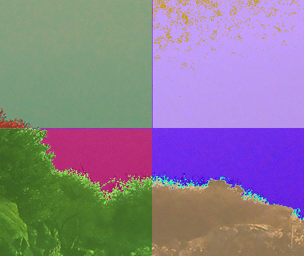

## トリミング
```python
# -*- coding: utf-8 -*-
import cv2, matplotlib
import numpy as np
import matplotlib.pyplot as plt

###
# 画素へのアクセス
###

#イメージ生成
image = cv2.imread('sample.png')

x = 200
y = 180
width = 150
height = 120

dstImg = image[y:y+height,x:x+width]

cv2.imshow('image',image)
cv2.imshow('dst',dstImg)

cv2.imwrite('trimming.png',dstImg)
cv2.waitKey(0)

```
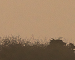

## リサイズ
```python
# -*- coding: utf-8 -*-
import cv2, matplotlib
import numpy as np
import matplotlib.pyplot as plt

###
# 画素へのアクセス
###

#イメージ生成
image = cv2.imread('sample.png')

width = image.shape[0]
height = image.shape[1]
resizeImg = cv2.resize(image,(height/2,width/2))
cv2.imshow('original',image )
cv2.imshow('resize',resizeImg)
cv2.imwrite('resize.png',resizeImg)
cv2.waitKey(0)
```
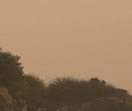


## 加算
```python
# -*- coding: utf-8 -*-
import cv2, matplotlib
import numpy as np
import matplotlib.pyplot as plt

###
# 画素へのアクセス
###

#イメージ生成
sample1 = cv2.imread('addsample1.png')
sample2 = cv2.imread('addsample2.png')

width = 300
height = 300

addImg = np.zeros((height,width,3),np.uint8)

for x in xrange(0,width):
  for y in xrange(0,height):
    addpixel = sample1[x,y] + sample2[x,y]
    addImg[x,y] = addpixel


cv2.imshow('add',addImg)
cv2.imwrite('add.png',addImg)
cv2.waitKey(0)
```
 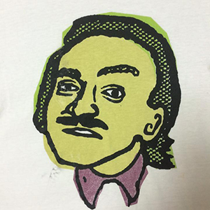
 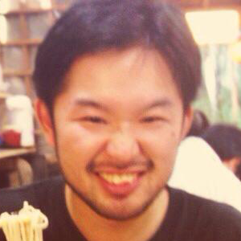
 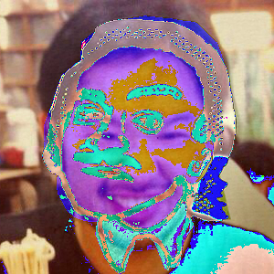


## アフィン変換
```python
# -*- coding: utf-8 -*-
import cv2
import numpy as np

img = cv2.imread('sample.png')

# cv2.imshow('image',img)

width = img.shape[1]
height = img.shape[0]
center = tuple(np.array([width/2, height/2]))
size = tuple(np.array([width,height]))

# 回転軸を指定しないafine
# 回転させたい角度
rad = 45*np.pi/180
movX = 10
movY = 10

matrix = [
  [np.cos(rad),-1*np.sin(rad),movX],
  [np.sin(rad),np.cos(rad),movY]
]

afMat = np.float32(matrix)

# 回転軸を指定するafine
angle = 45
scale = 1.0
rotMat = cv2.getRotationMatrix2D(center,angle,scale)

# afnImg = cv2.warpAffine(img,afMat,size,flags=cv2.INTER_LINEAR)
afnImg = cv2.warpAffine(img,rotMat,size,flags=cv2.INTER_CUBIC)
cv2.imshow('affine image',afnImg)
cv2.imwrite('affine.png',afnImg)
cv2.waitKey(0)
cv2.destroyAllWindows()
```
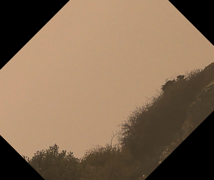


## 反転
```python
# -*- coding: utf-8 -*-
import cv2
import numpy as np

img = cv2.imread('sample.png')
rimg = img.copy()
fimg = img.copy()
rimg = cv2.flip(img,1)
fimg = cv2.flip(img,0)

cv2.imshow('Original',img)
cv2.imshow('Vertical',rimg)
cv2.imshow('Horizontal',fimg)

cv2.imwrite('flip-vertical.png',rimg)
cv2.imwrite('flip-horizontal.png',fimg)


cv2.waitKey(0)
cv2.destroyAllWindows()
```
上下に反転   
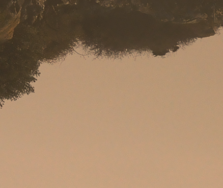   


左右に反転   
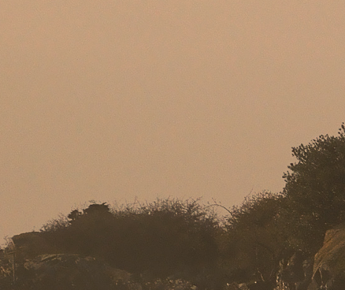   


## グレースケール変換
```python
# -*- coding: utf-8 -*-
import cv2, matplotlib
import numpy as np
import matplotlib.pyplot as plt

img = cv2.imread('sample.png')

gray = cv2.cvtColor(img,cv2.COLOR_RGB2GRAY)
cv2.imshow('result',gray)
cv2.imwrite('grey.png',gray)
cv2.waitKey(0)
```
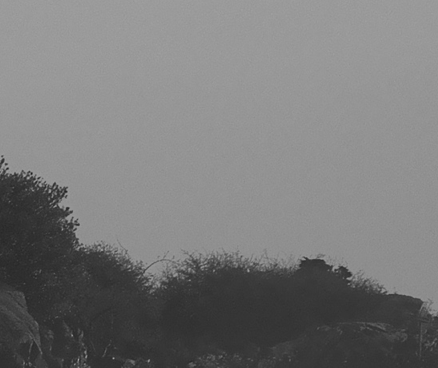   

## 描画関数のCircleを使う。
```python
import cv2
import numpy as np

img = cv2.imread('sample.png')
w = 400
h = 300

plane = np.zeros([300,500],np.uint8)
center = tuple([plane.shape[1]/2,plane.shape[0]/2])
radius = 100
color = tuple([255,0,0])
thickness = 2
cv2.circle(plane,center,radius,color,thickness)
cv2.imshow('plane',plane)
cv2.imwrite('circle.png',plane)
cv2.waitKey(0)
```
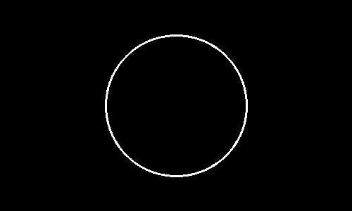   

## 色の抽出
```python
# -*- coding: utf-8 -*-
import cv2
import numpy as np
original = cv2.imread('sample.png', 1)
img = original.copy()
dst = np.zeros(img.shape,np.uint8)

hsv = cv2.cvtColor(img,cv2.COLOR_BGR2HSV)

colorRange = [0,10]
thanSaturate = 0
thanValue = 0

for x in xrange(0,img.shape[1]):
  for y in xrange(0,img.shape[0]):
    # HSV
    if hsv[y,x][0] >= colorRange[0] and hsv[y,x][0] < colorRange[1] and hsv[y,x][1] > thanSaturate and hsv[y,x][2] > thanValue:
      radius = 1
      color = tuple([255,0,0])
      thicness = 1
      cv2.circle(img,tuple([x,y]),radius,color,thicness)

      dst[y,x] = img[y,x]

cv2.imshow('Original',original)
cv2.imshow('Add',img)
cv2.imshow('Diff',dst)
cv2.imwrite('add.png',img)
cv2.imwrite('diff.png',dst)
cv2.waitKey(0)
```
#### Original
   
#### Extraction
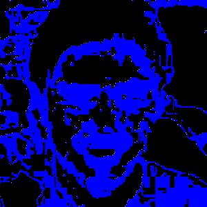   
#### Add
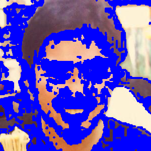   


## カラーチェンネル入れ替え
```python
import cv2
import numpy as np
import matplotlib
import matplotlib.pyplot as plt

img = cv2.imread('sample.png')
bgr = cv2.split(img)

blue = bgr[0]
green = bgr[1]
red = bgr[2]

# plt.add(blue)
# plt.show(blue)

changeChannel = cv2.merge([red,green,blue])

cv2.imshow('changeChannel',changeChannel)
cv2.imwrite('changeChannel.png',changeChannel)
cv2.waitKey(0)
```
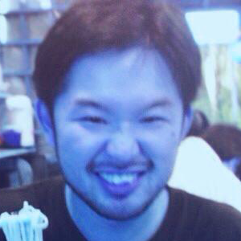   


<br/>

勉強すること無限なのでたぶん続編あります。
